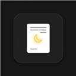

  
  
  # Google Docs: True Dark Mode

  **Because staring at a 100% brightness white screen at 2 AM is an absolute nightmare.**

---

Let’s be real for a second. The native Google Docs light mode is basically a flashbang to the retinas. 
If you’ve ever tried to document a project, write an essay, or just get some work done after the sun goes down, you know the pain. You squint. You turn your monitor brightness down to zero. You suffer.

Not anymore. 

**Google Docs: True Dark Mode** is a Chrome extension that completely overhauls the Google Docs interface into a sleek, premium, and eye-friendly dark aesthetic using Material 3 design tokens. 

It doesn't just invert colors lazily—it carefully targets menus, sidebars, tooltips, dialogs, and the canvas itself to ensure everything is perfectly legible and beautiful.

## ✨ Features
* **Deep UI Theming:** Custom dark mode CSS that targets hidden UI layers (Dropdown menus, Find & Replace dialogs, Color Pickers, Comment sidebars).
* **Adjustable Paper Brightness:** A sleek popup UI with a custom slider. Fine-tune the exact brightness/darkness of your document canvas from 50% (pitch black) to 150% (light grey).
* **Instant Keyboard Shortcut:** Press `Alt + D` anytime inside Google Docs to instantly toggle the theme on or off without reaching for your mouse.
* **No Inverted Images:** Smart CSS filters ensure your embedded images and graphics stay true to their original colors while the paper turns dark.

## 🚀 Why isn't this on the Chrome Web Store?

Because Google demands a $5 developer fee to publish it, and frankly, in this economy? I am broke. That $5 is going straight towards a fancy coffee to fuel my late-night coding sessions instead of filling a multi-billion dollar corporation's coffers. 

But don't worry! You can install it yourself for free in about 15 seconds. Here is how:

1. **Download this repository** as a ZIP file (Click the green `Code` button > `Download ZIP`) and extract it to a folder on your computer.
2. Open Google Chrome (or Microsoft Edge/Brave) and go to your extensions page:
   - Type `chrome://extensions/` in your address bar and hit Enter.
3. Turn on **Developer mode** using the toggle switch in the top right corner.
4. Click the **Load unpacked** button in the top left.
5. Select the extracted folder where this code lives.

That's it! Open any Google Doc, hit `Alt + D` (or click the extension icon), and welcome to the dark side. 🦇

## 🛠️ Built With
* Vanilla JavaScript
* Manifest V3
* Deep hatred for `#FFFFFF`

## 📝 License
This project is open-source. Feel free to fork, tweak, and make your late-night writing sessions even cozier.
